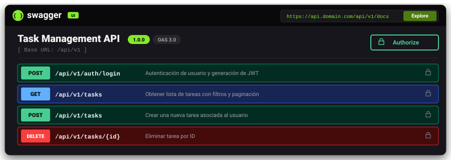

<p align="center">
  <a href="https://ivanepais.github.io/portfolio/">
    
  </a>
</p>

---

## 💻 App

> **Try the API!** using the link: **[task-manager-api](https://task-manager-api-9gi8.onrender.com/api/v1/docs)** or click on the banner.

* **Framework:** [NestJS](https://nestjs.com/) (Node.js v24)
* **ORM:** [TypeORM](https://typeorm.io/)
* **DB:** PostgreSQL / [Neon.tech](https://neon.tech/) (Serverless Postgres with SSL)
* **Doc:** Swagger UI (`@nestjs/swagger`)
* **Auth:** JWT con Refresh Tokens
* **Container:** Docker (Multi-stage build)
* **Hosting:** [Render](https://www.render.com/)

---

## ✨ Características Principales

* 🔒 **Authentication and Authorization:** Secure registration and login with JWT and refresh token rotation.
* ✅ **Crud:** Task, categories management and filters.
* 🛡️ **Data validation:** Global use of `ValidationPipe` with strict DTOs (`class-validator` and `class-transformer`).
* 🗄️ **DB Migrations:** Schema version control using TypeORM CLI.
* 📄 **Interactive Documentation:** Integrated Swagger UI with Bearer token support.


---

## Project Structure

```text
src/
├── auth/          # auth (Login, Register, Refresh)
├── users/         # users module: entity, dtos
├── tasks/         # tasks module: entity, dtos
├── categories/    # categories module: entity, dtos
├── common/        # Filters
├── database/      # TypeORM config, migraciones
│   └── migrations/
├── app.module.ts  # Main module, validation with Joi
└── main.ts        # Entry point, Swagger UI
```

---

## 🚀 Local Installation and Implementation

To set up the local development environment and run the application on your computer

**Requirements:**

Node.js: v24.11^

npm: v11^

Docker: v29.8^

PostgreSQL: local or Docker

---

1. **Clone the repo:**
Download the copy of the project to your machine using the terminal.

```sh
git clone https://github.com/ivanepais/task-manager-api.git
```

2. **Access the repo:**
Navigate to the root folder where the project settings are located.

```bash
cd task-manager-api
```

3. **Install dependencies:**
With NodeJS, you can download and install all the necessary packages and libraries specified in the configuration file.

```bash
$ npm install
```

---


## Compile and run the project

```bash
# development
$ npm run start

# watch mode
$ npm run start:dev

# production mode
$ npm run start:prod
```

---


## Run tests

```bash
$ npm run test
```


---


## 📄 License

This project is licensed under the MIT License.
See the file [LICENSE](LICENSE) for more details.

